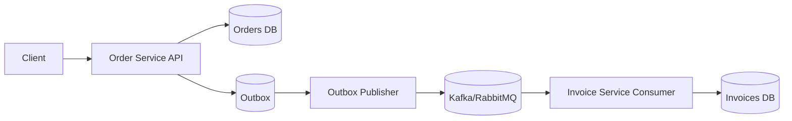

# Event-Driven Order/Invoice Microservice

Production blueprint for event-driven systems with reliable messaging, DDD, and real-world operational patterns.

## What It Solves
- Lost events (transactional outbox)
- Duplicate deliveries (idempotent consumer)
- Fragile integrations (versioned contracts)
- Operational blind spots (health/metrics/logs)

## Architecture



## Quickstart

```bash
docker-compose up -d
```

## Demo Flow

```bash
# Create order
curl -X POST http://localhost:8080/orders \
  -H 'Content-Type: application/json' \
  -H 'X-Correlation-Id: demo-123' \
  -d '{
    "customerId": "11111111-1111-1111-1111-111111111111",
    "lines": [
      {"productId": "22222222-2222-2222-2222-222222222222", "quantity": 2, "unitPrice": "10.00", "currency": "USD"}
    ]
  }'

# Confirm order
curl -X POST http://localhost:8080/orders/{orderId}/confirm

# Get invoice
curl "http://localhost:8081/invoices?orderId={orderId}"
```

## Reliability (How It Works)
- Outbox pattern in Order Service (same transaction for state + event)
- Publisher retries failed deliveries
- Invoice Service consumes idempotently using `processed_events`
- Correlation IDs included in logs

## Observability
- JSON structured logging with correlation IDs
- OpenTelemetry API dependency included for tracing exporters

## Messaging Modes
- Kafka (default)
- RabbitMQ (toggle with `app.messaging.mode=rabbitmq`)
- Redis Streams (documented alternative)

Example toggle:

```bash
SPRING_APPLICATION_JSON='{\"app\":{\"messaging\":{\"mode\":\"rabbitmq\"}}}' mvn -pl order-service,invoice-service spring-boot:run
```

## Extension Points / Advanced Modules
These are documented but not fully implemented to avoid risky production defaults:
- Saga orchestration and compensations
- Schema registry integration
- Multi-region partitioning strategy
- Advanced retry/backoff tuning
- Security hardening for event bus
- Load testing and performance tuning pack

## Professional Services
Need production hardening, migration support, or deep reliability reviews? Engage for design workshops, incident-proof rollout plans, and safe delivery at scale.

## Documentation
- `docs/ARCHITECTURE.md`
- `docs/DDD_MODEL.md`
- `docs/OUTBOX_PATTERN.md`
- `docs/IDEMPOTENCY.md`
- `docs/EVENT_VERSIONING.md`
- `docs/OPERATIONS.md`
- `docs/LIMITATIONS.md`
- Event contracts live in `contracts/`

## Run Locally (Maven)

```bash
mvn -pl order-service,invoice-service spring-boot:run
```

## Tests

```bash
# Unit + contract tests
mvn -pl order-service,invoice-service test

# Integration tests (Testcontainers)
mvn -pl integration-tests test
```
