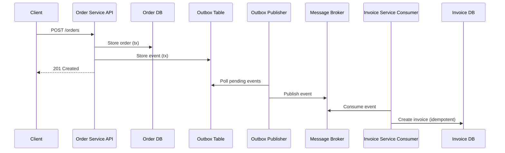

# Architecture

This repository demonstrates a production-grade, event-driven, DDD-aligned microservice architecture with reliable messaging patterns.

## High-Level Flow

## Key Components

- Order Service: manages order lifecycle, owns Outbox Pattern.
- Invoice Service: creates invoices when `OrderConfirmed` is received, with idempotency.
- Contracts: versioned event schemas in `contracts/`.

## Messaging Modes

- Kafka (default)
- RabbitMQ (optional toggle via `app.messaging.mode=rabbitmq`)
- Redis Streams (documented alternative)
